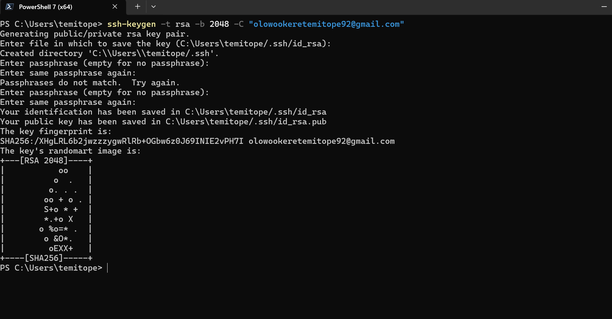
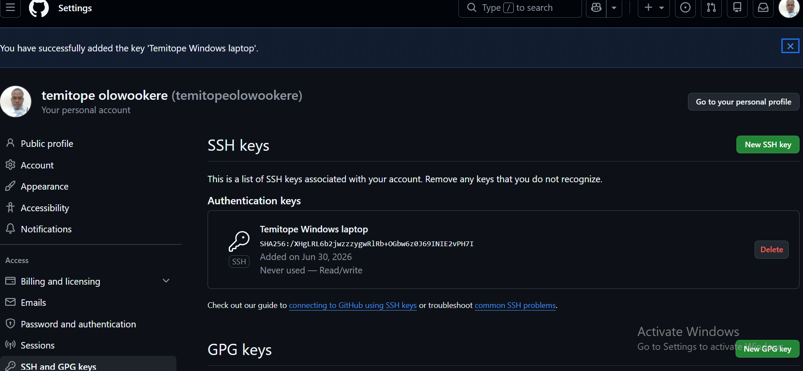
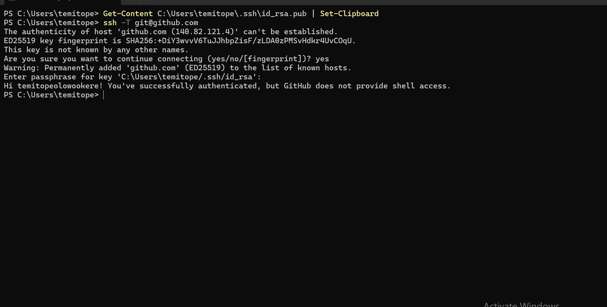
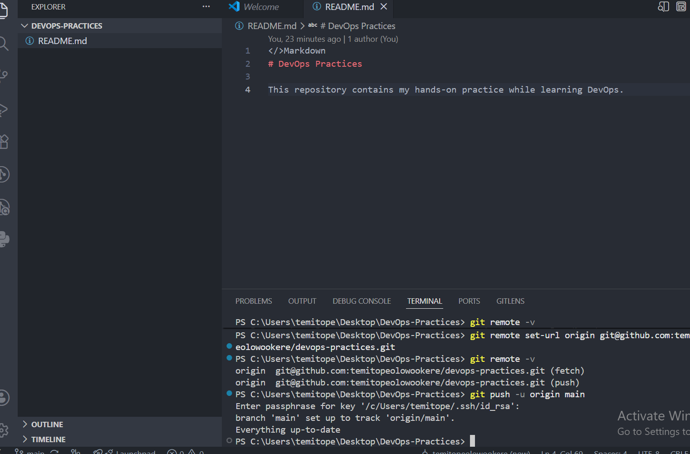

# System Installation

## Project Overview

This project documents the installation, configuration, and verification of essential development tools required for a DevOps environment. The tools covered include OpenSSH, Git, and Visual Studio Code. It also demonstrates the generation of SSH key pairs, configuration of secure authentication with GitHub, and the successful creation and deployment of a Git repository using SSH authentication.

The purpose of this project is to provide a well-documented installation guide with supporting screenshots, ensuring that each tool is correctly installed, configured, and verified for use in modern DevOps workflows.

## Objectives

The objectives of this project are to:

- Install and verify OpenSSH on the local machine.
- Generate an SSH key pair for secure authentication.
- Configure GitHub to use SSH authentication.
- Test and verify secure communication between the local machine and GitHub.
- Install and verify Git.
- Install and verify Visual Studio Code.
- Demonstrate the successful creation and deployment of a Git repository.
- Document every step using Markdown and screenshots.

**Author:** Temitope Olowookere

**Course:** DevOps Engineering

**Module:** System Installation

## Prerequisites

Before proceeding with the installation and configuration of the required tools, ensure the following requirements are met:

- A computer running Windows 10 or Windows 11 or macbook or linux but in this case i am using a windows Os.

- A stable internet connection for downloading software.

- A GitHub account for version control and remote repository management.

- Basic familiarity with using the Windows Command Prompt or PowerShell.

- Visual Studio Code installed for editing Markdown files and managing project files.

## Installing and Verifying OpenSSH

### Introduction

OpenSSH (Open Secure Shell) is a suite of secure networking tools that enables encrypted communication between computers over a network. It is commonly used by DevOps engineers and system administrators for secure remote server access, file transfers, and authentication with platforms such as GitHub.

### Installing OpenSSH on Windows

OpenSSH is included as an optional feature in modern versions of Windows 10 and Windows 11. If it is not already installed, it can be installed using the Windows Optional Features interface or by using PowerShell.

To install OpenSSH Client using PowerShell, run:

```powershell
Add-WindowsCapability -Online -Name OpenSSH.Client~~~~0.0.1.0
```

After installation, verify that OpenSSH has been successfully installed by checking its version.

Run the following command:

```powershell
ssh -V
```

In my case, OpenSSH was already installed on my computer. Therefore, I verified the installation by checking the installed version.


**Figure 1:** Verification that OpenSSH is successfully installed on the Windows operating system.


## Generating SSH Key Pairs

### Introduction

SSH key pairs provide a secure method of authentication between a local computer and a remote server or service without transmitting passwords over the network. An SSH key pair consists of two keys:

- **Private Key:** Stored securely on the local computer and must never be shared.
- **Public Key:** Shared with remote services such as GitHub to verify the identity of the local machine.

Using SSH keys improves security, simplifies authentication, and is considered a best practice in DevOps environments.

### Generating an SSH Key Pair

The course demonstrated the generation of an RSA SSH key pair using the following command:

```powershell
ssh-keygen -t rsa -b 2048 -C "olowookeretemitope92@gmail.com"
```

During the key generation process:

1.  I Choose the default location to save the key by pressing **Enter**.
2. Enter a passphrase to further secure the private key (optional but recommended).
3. Confirm the passphrase.

After successful execution, two files are created inside the `.ssh` directory:

- `id_rsa` – Private Key
- `id_rsa.pub` – Public Key

In my project, I successfully generated the SSH key pair using the command above.



**Figure 2:** Successful generation of the RSA SSH key pair.

> **Best Practice Note**
>
> Although RSA keys are still supported and were used in this exercise, modern SSH implementations recommend using **Ed25519** keys because they provide stronger security, faster performance, and shorter key lengths. After completing this exercise, I migrated my development environment to an Ed25519 SSH key as part of adopting current industry best practices.The migration gave me alot of insight. i migrated and deleted the rsa on github. i had already followed the module write up which suggested we use the rsa but in the video,**ED25519** was used which was the reason why i had to migrate aside the fact that it is more modern. 

## Configuring GitHub SSH Authentication

### Introduction

After generating an SSH key pair, the next step is to configure GitHub to recognize the local machine. This is achieved by adding the public SSH key to the GitHub account. Once configured, Git operations such as cloning, pushing, and pulling repositories can be performed securely without repeatedly entering GitHub credentials.

### Copying the Public SSH Key

The public SSH key can be copied to the clipboard using PowerShell with the following command:

```powershell
Get-Content $env:USERPROFILE\.ssh\id_rsa.pub | Set-Clipboard
```

After copying the key, log in to your GitHub account and navigate to:

**Settings → SSH and GPG Keys → New SSH Key**

Paste the copied public key into the **Key** field, provide a descriptive title, and click **Add SSH Key**.

In this project, the SSH public key was successfully added to my GitHub account.



**Figure 3:** The SSH public key successfully added to the GitHub account.

---

### Testing the SSH Connection

After adding the public key to GitHub, it is important to verify that SSH authentication is working correctly.

Run the following command:

```powershell
ssh -T git@github.com
```

If the authentication is successful, GitHub responds with a welcome message similar to:

```text
Hi <temitope>! You've successfully authenticated, but GitHub does not provide shell access.
```

This message confirms that GitHub recognizes the local machine and that SSH authentication has been successfully configured.

In my project, the SSH authentication test completed successfully.



**Figure 4:** Successful SSH authentication between the local computer and GitHub.


## Installing and Verifying Git

### Introduction

Git is a distributed version control system that enables developers to track changes in source code, collaborate with other developers, and maintain a complete history of project modifications. It is one of the most essential tools in modern software development and DevOps, providing seamless integration with platforms such as GitHub, GitLab, and Bitbucket.

### Installing Git on Windows

Git can be downloaded from the official Git website:

https://git-scm.com/downloads

After downloading the installer:

1. Run the Git installer.
2. Accept the license agreement.
3. Choose the installation location.
4. Select the preferred configuration options or keep the default settings.
5. Complete the installation process.

After installation, verify that Git is installed successfully by running the following command:

```powershell
git --version
```

In my case, Git was already installed on my computer. Therefore, I verified the installation by checking the installed version from PowerShell.


**Figure 5:** Verification that Git is successfully installed on the Windows operating system.

### Why Git is Important in DevOps

Git plays a vital role in DevOps because it enables version control, collaboration, change tracking, and integration with Continuous Integration and Continuous Deployment (CI/CD) pipelines. It allows multiple developers to work on the same project efficiently while maintaining a complete history of changes.


## Installing and Verifying Visual Studio Code

### Introduction

Visual Studio Code (VS Code) is a lightweight, cross-platform source code editor developed by Microsoft. It provides a rich development environment with features such as syntax highlighting, IntelliSense, debugging, integrated terminal, Git integration, and support for thousands of extensions. It is widely used by developers and DevOps engineers for writing code, editing configuration files, creating documentation, and managing projects.

### Installing Visual Studio Code on Windows

Visual Studio Code can be downloaded from the official website:

https://code.visualstudio.com/

To install Visual Studio Code:

1. Download the installer from the official website.
2. Run the installer.
3. Accept the license agreement.
4. Choose the installation directory.
5. Select the recommended installation options, including adding VS Code to the system PATH.
6. Complete the installation process.

After installation, verify that VS Code is correctly installed by running the following command:

```powershell
code --version
```

In my case, Visual Studio Code was already installed on my computer. Therefore, I verified the installation by checking the installed version from PowerShell.


**Figure 6:** Verification that Visual Studio Code is successfully installed on the Windows operating system.

### Why Visual Studio Code is Important in DevOps

Visual Studio Code is one of the most widely used tools in DevOps because it provides an efficient environment for writing and managing source code, infrastructure-as-code files, shell scripts, YAML configuration files, Dockerfiles, Kubernetes manifests, and Markdown documentation. Its integrated Git support and extensive extension ecosystem make it an essential productivity tool for DevOps engineers.


## Creating and Pushing the Repository to GitHub

### Introduction

After installing and configuring the required development tools, the final step was to create a local Git repository and publish it to GitHub. This enables version control, remote backup, collaboration, and project sharing.

### Initializing the Local Repository

A new project folder was created and initialized as a Git repository using the following command:

```powershell
git init
```

This command creates a hidden `.git` directory that enables Git version control within the project.

### Staging and Committing Files

After creating the project files, they were staged using:

```powershell
git add .
```

The staged files were then committed to the local repository using:

```powershell
git commit -m "Initial commit"
```

This created the first commit in the project's version history.

### Connecting the Local Repository to GitHub

A new repository was created on GitHub.

The local repository was then connected to the remote repository using SSH:

```powershell
git remote add origin git@github.com:temitopeolowookere/devops-practices.git
```

To use the modern default branch name, the branch was renamed to **main**:

```powershell
git branch -M main
```

### Pushing the Repository to GitHub

The project was uploaded to GitHub using:

```powershell
git push -u origin main
```

The successful push confirmed that the local repository was securely connected to GitHub through SSH authentication.



**Figure 7:** Successfully pushing the local Git repository to GitHub using SSH authentication.

## Challenges Encountered

During the completion of this project, a few challenges were encountered:

- OpenSSH, Git, and Visual Studio Code were already installed on my computer. Therefore, instead of documenting the installation process through screenshots, I verified their installation using version commands.
- While generating the SSH key pair, an incorrect passphrase confirmation resulted in a retry before the key pair was successfully generated.
- Initially, the local Git repository was configured to use HTTPS. This was later changed to SSH authentication to improve security and align with DevOps best practices.
- Understanding the relationship between SSH keys, Git, and GitHub required careful study, particularly the distinction between the public and private keys.
- Organizing screenshots and technical documentation into a professional Markdown document required careful planning to ensure clarity and consistency.

## Lessons Learned

This project provided practical experience in setting up a development environment for DevOps activities. Through completing the tasks, I gained a better understanding of:

- The purpose and importance of OpenSSH.
- How SSH key pairs are generated and used for secure authentication.
- The difference between public and private SSH keys.
- How GitHub authenticates users through SSH.
- The role of Git in version control and collaborative software development.
- How to create and publish Git repositories using GitHub.
- The importance of documenting technical procedures using Markdown.
- The value of organizing project documentation in a structured and professional manner.


## Technologies Used

The following tools and technologies were used in this project:

- Windows PowerShell
- OpenSSH
- Git
- GitHub
- Visual Studio Code
- Markdown

## Skills Demonstrated

This project demonstrates the following technical skills:

- Software installation and verification
- SSH configuration
- SSH key generation and management
- Git version control
- GitHub repository management
- Secure authentication using SSH
- Markdown documentation
- Technical documentation
- Command-line operations

## Conclusion

This project successfully documented the installation, configuration, and verification of essential development tools required for a DevOps environment. OpenSSH, Git, and Visual Studio Code were verified, SSH authentication with GitHub was successfully configured, and a Git repository was created and published using secure SSH authentication.

In addition to completing the required installation tasks, this project reinforced the importance of version control, secure authentication, and technical documentation in modern DevOps practices. The experience gained provides a strong foundation for future modules involving Linux administration, cloud computing, containerization, infrastructure automation, and Continuous Integration/Continuous Deployment (CI/CD).

